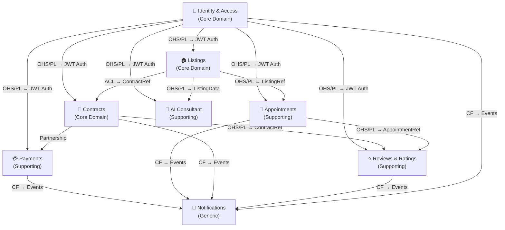

# 02 — Bounded Contexts (DDD)

## Introducción

El dominio de PropConnect se descompone en **8 bounded contexts** usando Domain-Driven Design. Cada contexto encapsula una capacidad de negocio cohesiva y se comunica con los demás a través de contratos explícitos.

---

## BC-1: Identity & Access (IAM)

| Campo | Detalle |
|---|---|
| **Nombre** | Identity & Access |
| **Propósito** | Gestiona el registro, autenticación, autorización y manejo de roles de todos los usuarios de la plataforma. |
| **Contextos Upstream** | Ninguno |
| **Contextos Downstream** | Todos los demás contextos |
| **Patrón de Integración** | OHS/PL (Open Host Service / Published Language) — expone un token JWT estándar que todos consumen |

### Entidades Core

| Entidad | Campos Clave | Restricciones |
|---|---|---|
| `User` | `id: UUID`, `email: string`, `passwordHash: string`, `status: ACTIVE\|SUSPENDED\|PENDING` | email único, status requerido |
| `Role` | `id: UUID`, `name: CONSULTANT\|SELLER\|ADVISOR\|PROCESSOR\|ADMIN`, `permissions: string[]` | nombre único |
| `UserRole` | `userId: UUID`, `roleId: UUID`, `assignedAt: DateTime` | un usuario puede tener múltiples roles |
| `Session` | `id: UUID`, `userId: UUID`, `token: string`, `expiresAt: DateTime` | token único, expira obligatoriamente |

### Eventos de Dominio

| Tipo | Evento | Descripción |
|---|---|---|
| **Publicados** | `UserRegistered` | Un nuevo usuario completó el registro |
| **Publicados** | `UserRoleAssigned` | Se asignó un rol a un usuario |
| **Publicados** | `UserSuspended` | Un administrador suspendió una cuenta |
| **Consumidos** | Ninguno | Es el contexto raíz de identidad |

---

## BC-2: Listings (Publicaciones de Inmuebles)

| Campo | Detalle |
|---|---|
| **Nombre** | Listings |
| **Propósito** | Gestiona el ciclo de vida completo de las publicaciones de inmuebles: creación, edición, visibilidad, búsqueda y estado. |
| **Contextos Upstream** | Identity & Access |
| **Contextos Downstream** | Contracts, Reviews, Appointments, Payments |
| **Patrón de Integración** | OHS/PL para consultas externas; ACL con IAM para validar identidad del vendedor |

### Entidades Core

| Entidad | Campos Clave | Restricciones |
|---|---|---|
| `Listing` | `id: UUID`, `sellerId: UUID`, `title: string`, `description: text`, `type: RENT\|SALE`, `price: Decimal`, `status: DRAFT\|PUBLISHED\|PAUSED\|SOLD\|RENTED`, `location: GeoPoint` | precio > 0, sellerId referencia a User con rol SELLER |
| `Property` | `id: UUID`, `listingId: UUID`, `area: Float`, `rooms: Int`, `bathrooms: Int`, `features: string[]`, `mediaUrls: string[]` | área > 0 |
| `ListingBoost` | `id: UUID`, `listingId: UUID`, `boostType: FEATURED\|TOP_SEARCH`, `startDate: Date`, `endDate: Date`, `isPaid: Boolean` | endDate > startDate |
| `ListingView` | `id: UUID`, `listingId: UUID`, `viewerId: UUID?`, `viewedAt: DateTime`, `source: WEB\|MOBILE` | viewerId nullable (anónimos) |

### Eventos de Dominio

| Tipo | Evento | Descripción |
|---|---|---|
| **Publicados** | `ListingPublished` | Una publicación fue activada y es visible |
| **Publicados** | `ListingBoosted` | Una publicación recibió un boost pagado |
| **Publicados** | `ListingSoldOrRented` | El estado cambió a SOLD o RENTED |
| **Consumidos** | `UserRegistered` | Para asociar la cuenta del vendedor |
| **Consumidos** | `PaymentCompleted` | Para activar un ListingBoost |

---

## BC-3: Contracts (Contratos de Servicio)

| Campo | Detalle |
|---|---|
| **Nombre** | Contracts |
| **Propósito** | Gestiona la contratación de asesores y tramitadores por parte de los vendedores, incluyendo el acceso condicional a información completa del inmueble. |
| **Contextos Upstream** | Identity & Access, Listings |
| **Contextos Downstream** | Payments, Notifications |
| **Patrón de Integración** | ACL — traduce el modelo de Listings a su propio modelo de contrato |

### Entidades Core

| Entidad | Campos Clave | Restricciones |
|---|---|---|
| `Contract` | `id: UUID`, `sellerId: UUID`, `professionalId: UUID`, `listingId: UUID`, `type: ADVISOR\|PROCESSOR`, `status: PENDING\|ACTIVE\|COMPLETED\|CANCELLED`, `commissionRate: Decimal`, `startDate: Date`, `endDate: Date?` | commissionRate entre 0.01 y 0.50 |
| `ContractApplication` | `id: UUID`, `professionalId: UUID`, `listingId: UUID`, `message: text`, `appliedAt: DateTime`, `status: PENDING\|ACCEPTED\|REJECTED` | un profesional solo puede aplicar una vez por listing |
| `AccessGrant` | `id: UUID`, `contractId: UUID`, `grantedAt: DateTime`, `revokedAt: DateTime?` | solo existe si el contrato está ACTIVE |

### Eventos de Dominio

| Tipo | Evento | Descripción |
|---|---|---|
| **Publicados** | `ContractCreated` | Un contrato fue iniciado entre vendedor y profesional |
| **Publicados** | `ContractSigned` | Ambas partes aceptaron, contrato activo |
| **Publicados** | `ContractCompleted` | El proceso finalizó exitosamente |
| **Publicados** | `ContractCancelled` | El contrato fue cancelado |
| **Consumidos** | `ListingPublished` | Para saber qué listings están disponibles para contratos |
| **Consumidos** | `PaymentCompleted` | Para activar o confirmar el contrato |

---

## BC-4: Payments (Pagos y Facturación)

| Campo | Detalle |
|---|---|
| **Nombre** | Payments |
| **Propósito** | Procesa todos los flujos monetarios de la plataforma: pagos de anuncios boost, comisiones de asesores/tramitadores, y generación de facturas. |
| **Contextos Upstream** | Identity & Access, Listings, Contracts |
| **Contextos Downstream** | Notifications |
| **Patrón de Integración** | ACL con Stripe (gateway externo); Partnership con Contracts |

### Entidades Core

| Entidad | Campos Clave | Restricciones |
|---|---|---|
| `Payment` | `id: UUID`, `payerId: UUID`, `amount: Decimal`, `currency: string`, `type: BOOST\|COMMISSION`, `status: PENDING\|COMPLETED\|FAILED\|REFUNDED`, `externalId: string`, `createdAt: DateTime` | amount > 0, externalId de Stripe |
| `Invoice` | `id: UUID`, `paymentId: UUID`, `issuedTo: UUID`, `total: Decimal`, `issuedAt: DateTime`, `downloadUrl: string` | issuedAt auto-generado |
| `PaymentMethod` | `id: UUID`, `userId: UUID`, `stripeCustomerId: string`, `last4: string`, `brand: string`, `isDefault: Boolean` | stripeCustomerId único |

### Eventos de Dominio

| Tipo | Evento | Descripción |
|---|---|---|
| **Publicados** | `PaymentCompleted` | Un pago fue procesado exitosamente |
| **Publicados** | `PaymentFailed` | El pago fue rechazado por la pasarela |
| **Publicados** | `InvoiceGenerated` | Se emitió una factura |
| **Consumidos** | `ListingBoosted` | Para generar la orden de cobro del boost |
| **Consumidos** | `ContractSigned` | Para habilitar el flujo de comisión |

---

## BC-5: Appointments (Citas y Agenda)

| Campo | Detalle |
|---|---|
| **Nombre** | Appointments |
| **Propósito** | Gestiona el agendamiento de citas entre consultores, vendedores, asesores y tramitadores para visitas a inmuebles u reuniones de proceso. |
| **Contextos Upstream** | Identity & Access, Listings |
| **Contextos Downstream** | Notifications |
| **Patrón de Integración** | OHS/PL — expone endpoints de disponibilidad y reserva |

### Entidades Core

| Entidad | Campos Clave | Restricciones |
|---|---|---|
| `Appointment` | `id: UUID`, `listingId: UUID`, `requesterId: UUID`, `hostId: UUID`, `scheduledAt: DateTime`, `status: PENDING\|CONFIRMED\|CANCELLED\|COMPLETED`, `type: VISIT\|MEETING`, `notes: text?` | scheduledAt debe ser futuro al crear |
| `Availability` | `id: UUID`, `userId: UUID`, `dayOfWeek: Int`, `startTime: Time`, `endTime: Time` | no se permiten solapamientos por usuario |
| `AppointmentReminder` | `id: UUID`, `appointmentId: UUID`, `sendAt: DateTime`, `sent: Boolean` | sendAt anterior al scheduledAt |

### Eventos de Dominio

| Tipo | Evento | Descripción |
|---|---|---|
| **Publicados** | `AppointmentScheduled` | Una cita fue agendada y está pendiente de confirmación |
| **Publicados** | `AppointmentConfirmed` | El host confirmó la cita |
| **Publicados** | `AppointmentCancelled` | Una de las partes canceló |
| **Consumidos** | `ContractSigned` | Para permitir que asesores/tramitadores agenden |
| **Consumidos** | `ListingSoldOrRented` | Para cancelar citas pendientes de una publicación inactiva |

---

## BC-6: Reviews & Ratings (Reseñas y Calificaciones)

| Campo | Detalle |
|---|---|
| **Nombre** | Reviews & Ratings |
| **Propósito** | Gestiona las calificaciones y reseñas entre todos los actores: consultores califican a VAT (Vendedor, Asesor, Tramitador), y viceversa. |
| **Contextos Upstream** | Identity & Access, Appointments, Contracts |
| **Contextos Downstream** | Notifications |
| **Patrón de Integración** | ACL — necesita traducir entidades de Contracts y Appointments a sus propios modelos |

### Entidades Core

| Entidad | Campos Clave | Restricciones |
|---|---|---|
| `Review` | `id: UUID`, `reviewerId: UUID`, `revieweeId: UUID`, `referenceId: UUID`, `referenceType: APPOINTMENT\|CONTRACT`, `rating: Int`, `comment: text?`, `createdAt: DateTime` | rating entre 1 y 5, un reviewer solo puede dejar una reseña por referencia |
| `RatingSummary` | `userId: UUID`, `average: Decimal`, `totalReviews: Int`, `lastUpdated: DateTime` | se recalcula en cada nueva reseña |
| `Complaint` | `id: UUID`, `complainantId: UUID`, `accusedId: UUID`, `description: text`, `status: OPEN\|REVIEWING\|RESOLVED`, `createdAt: DateTime` | description mínimo 50 caracteres |

### Eventos de Dominio

| Tipo | Evento | Descripción |
|---|---|---|
| **Publicados** | `ReviewSubmitted` | Un usuario dejó una reseña |
| **Publicados** | `ComplaintFiled` | Un usuario presentó una queja formal |
| **Consumidos** | `AppointmentCompleted` | Habilita la ventana de reseña |
| **Consumidos** | `ContractCompleted` | Habilita la ventana de reseña |

---

## BC-7: Notifications (Notificaciones)

| Campo | Detalle |
|---|---|
| **Nombre** | Notifications |
| **Propósito** | Entrega mensajes al usuario final a través de múltiples canales (email, push, in-app) en respuesta a eventos del resto del sistema. |
| **Contextos Upstream** | Todos los demás contextos |
| **Contextos Downstream** | Ninguno |
| **Patrón de Integración** | CF (Conformist) — se adapta a los eventos que los otros contextos publican, sin imponer su propio modelo |

### Entidades Core

| Entidad | Campos Clave | Restricciones |
|---|---|---|
| `Notification` | `id: UUID`, `userId: UUID`, `channel: EMAIL\|PUSH\|IN_APP`, `templateId: string`, `payload: JSON`, `status: PENDING\|SENT\|FAILED`, `createdAt: DateTime` | payload no puede ser nulo |
| `NotificationTemplate` | `id: string`, `subject: string?`, `bodyTemplate: text`, `channel: EMAIL\|PUSH\|IN_APP` | id único y descriptivo |
| `NotificationPreference` | `userId: UUID`, `channel: EMAIL\|PUSH\|IN_APP`, `eventType: string`, `enabled: Boolean` | por defecto todos habilitados |

### Eventos de Dominio

| Tipo | Evento | Descripción |
|---|---|---|
| **Publicados** | `NotificationSent` | Para auditoría interna |
| **Consumidos** | `UserRegistered`, `PaymentCompleted`, `PaymentFailed`, `AppointmentScheduled`, `AppointmentConfirmed`, `ContractSigned`, `ReviewSubmitted`, `InvoiceGenerated` | Todos los eventos relevantes del sistema |

---

## BC-8: AI Consultant (Asistente IA)

| Campo | Detalle |
|---|---|
| **Nombre** | AI Consultant |
| **Propósito** | Provee capacidades de inteligencia artificial para los consultores: recomendación de propiedades, chatbot de proceso y valoración estimada de inmuebles. |
| **Contextos Upstream** | Identity & Access, Listings |
| **Contextos Downstream** | Ninguno |
| **Patrón de Integración** | ACL — consume datos de Listings y los transforma en representaciones vectoriales o prompts |

### Entidades Core

| Entidad | Campos Clave | Restricciones |
|---|---|---|
| `AISession` | `id: UUID`, `userId: UUID`, `createdAt: DateTime`, `lastMessageAt: DateTime` | userId referencia a CONSULTANT |
| `AIMessage` | `id: UUID`, `sessionId: UUID`, `role: USER\|ASSISTANT`, `content: text`, `createdAt: DateTime` | content no vacío |
| `RecommendationRequest` | `id: UUID`, `userId: UUID`, `preferences: JSON`, `results: UUID[]`, `requestedAt: DateTime` | preferences incluye budget, type, location, rooms |

### Eventos de Dominio

| Tipo | Evento | Descripción |
|---|---|---|
| **Publicados** | `RecommendationServed` | Para analítica de uso del módulo IA |
| **Consumidos** | `ListingPublished` | Para indexar nuevos inmuebles en el motor de recomendación |
| **Consumidos** | `ListingSoldOrRented` | Para remover inmuebles del índice activo |

---

## Mapa de Contextos

### Leyenda de Patrones

| Patrón | Descripción |
|---|---|
| **OHS/PL** | Open Host Service / Published Language — el proveedor expone una API estable y bien documentada |
| **ACL** | Anti-Corruption Layer — el consumidor traduce el modelo del proveedor al suyo propio |
| **CF** | Conformist — el consumidor adopta el modelo del proveedor sin transformación |
| **Partnership** | Dos contextos evolucionan juntos con coordinación mutua |

### Agrupación por Tipo de Dominio

| Tipo | Contextos |
|---|---|
| **Core Domain** (diferenciadores del negocio) | Identity & Access, Listings, Contracts |
| **Supporting Subdomain** (apoyan al core) | Payments, Appointments, Reviews & Ratings, AI Consultant |
| **Generic Subdomain** (commodity) | Notifications |
