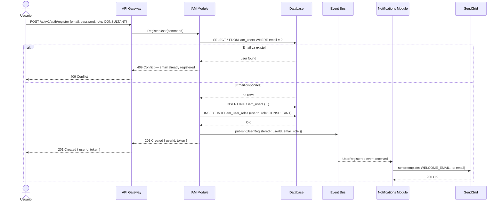
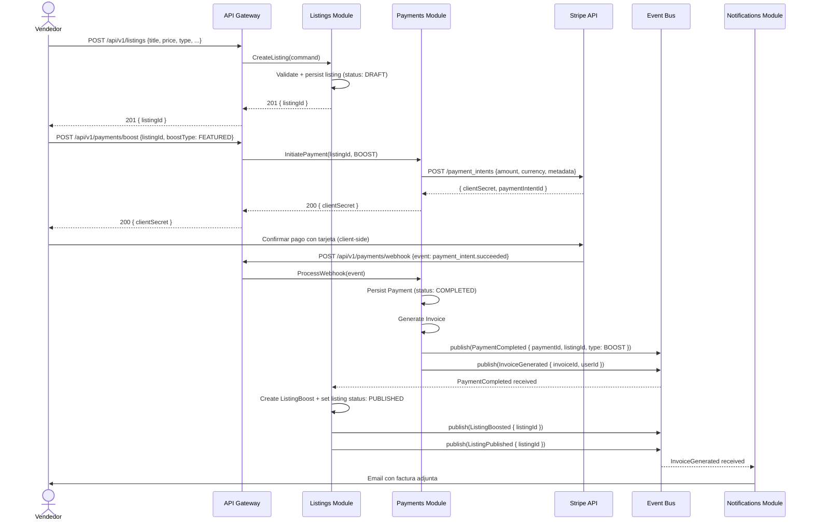
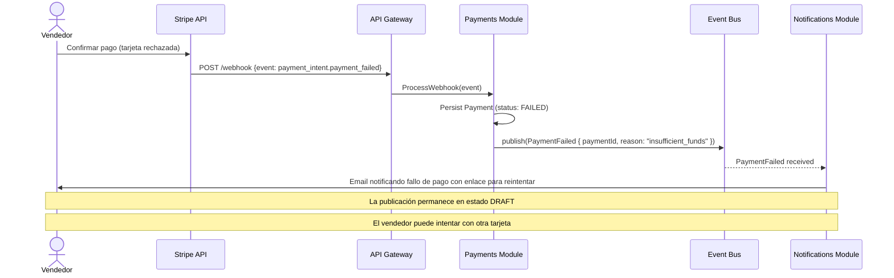
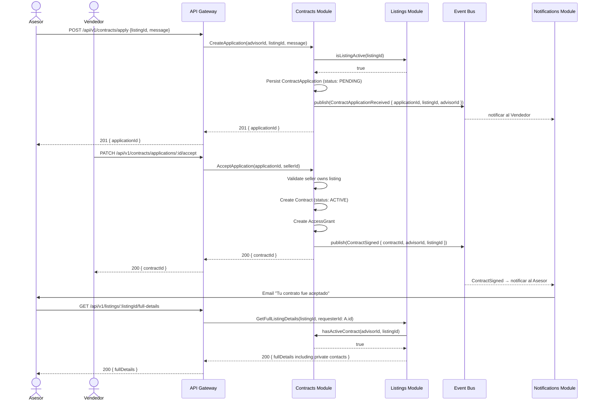
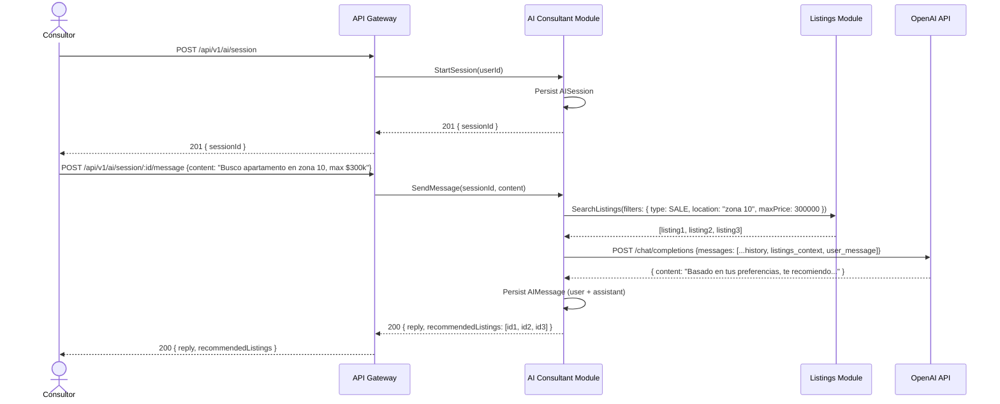

# 04 — Flujos de Datos e Interacciones

Este documento describe los flujos end-to-end más importantes del sistema PropConnect. Para cada flujo se incluye el escenario de negocio, diagrama de secuencia, camino feliz y al menos un camino de fallo o compensación.

---

## Flujo 1 — Registro y Verificación de Usuario

### Descripción del Escenario

Un nuevo usuario se registra en la plataforma como Consultor. El sistema valida los datos, crea la cuenta, asigna el rol correspondiente y envía un email de bienvenida.

### Diagrama de Secuencia

### Camino Feliz

1. Usuario envía email, contraseña y rol deseado.
2. IAM verifica que el email no exista.
3. Se crea el usuario y se asigna el rol.
4. Se publica el evento `UserRegistered` en el EventBus.
5. Se retorna un JWT con el userId y rol.
6. El módulo de Notifications recibe el evento y envía el email de bienvenida de forma asíncrona.

### Camino de Fallo

- **Email duplicado**: IAM retorna `409 Conflict` antes de insertar en la base de datos. No se publican eventos.
- **Error de base de datos al insertar**: IAM retorna `500 Internal Server Error`. Al no haberse insertado el registro, no se publica el evento y no hay inconsistencia.
- **Fallo en SendGrid**: Como la notificación es asíncrona y post-evento, un fallo en el envío de email no afecta el registro. El módulo de Notifications puede reintentar con backoff exponencial.

---

## Flujo 2 — Publicación de Inmueble con Boost Pagado

### Descripción del Escenario

Un Vendedor crea una publicación de inmueble y decide pagar un boost "Destacado" para tener mayor visibilidad. El sistema procesa el pago con Stripe y activa el boost al confirmarse el cobro.

### Diagrama de Secuencia

### Camino Feliz

1. Vendedor crea la publicación (queda en estado `DRAFT`).
2. Vendedor solicita un boost; el sistema crea un PaymentIntent en Stripe y retorna el `clientSecret`.
3. El cliente (frontend) confirma el pago directamente con Stripe.
4. Stripe envía un webhook `payment_intent.succeeded` a PropConnect.
5. Payments procesa el webhook, persiste el pago y publica `PaymentCompleted`.
6. Listings recibe el evento, activa el boost y publica la publicación.
7. Notifications envía la factura al vendedor por email.

### Camino de Fallo — Pago Rechazado

---

## Flujo 3 — Firma de Contrato con Asesor

### Descripción del Escenario

Un Asesor aplica a una publicación activa. El Vendedor acepta la solicitud, se firma el contrato y el Asesor obtiene acceso completo a los datos del inmueble.

### Diagrama de Secuencia

### Camino Feliz

1. El Asesor aplica a una publicación activa.
2. Se notifica al Vendedor.
3. El Vendedor acepta la aplicación.
4. Se crea el Contrato en estado `ACTIVE` y el `AccessGrant`.
5. Se notifica al Asesor.
6. El Asesor puede ahora acceder a los detalles completos del inmueble.

### Camino de Fallo — Aplicación a Publicación Inactiva

Si el Vendedor pausó o cerró la publicación antes de que el Asesor aplique, `CTR` consulta `LST.isListingActive()` y recibe `false`. El sistema retorna `422 Unprocessable Entity` con el mensaje `"La publicación no está disponible para contratos"`. No se crea ninguna aplicación ni se envían notificaciones.

### Camino de Fallo — Acceso Sin Contrato

Si un Asesor intenta acceder a `/listings/:id/full-details` sin un contrato activo, `CTR.hasActiveContract()` retorna `false` y el endpoint retorna `403 Forbidden`. Este control se ejecuta siempre, independientemente del rol del usuario.

---

## Flujo 4 — Consulta con Asistente IA

### Descripción del Escenario

Un Consultor inicia una sesión de IA para pedir recomendaciones de inmuebles basadas en sus preferencias (presupuesto, tipo, zona).

### Diagrama de Secuencia

### Camino de Fallo — OpenAI No Disponible

Si la llamada a OpenAI falla (timeout o error 5xx), el módulo `ai-consultant` retorna un mensaje de error genérico al usuario: `"El asistente no está disponible en este momento. Intenta de nuevo en unos segundos."` con código `503 Service Unavailable`. Los mensajes previos de la sesión se persisten correctamente. El usuario puede reintentar.
