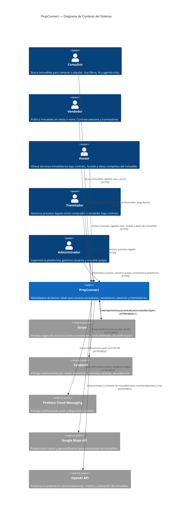

# 01 — Diagrama de Contexto del Sistema (C4 Nivel 1)

## Descripción

Este diagrama muestra PropConnect como una única caja de sistema, rodeada de todos sus actores humanos y sistemas externos. No se muestran componentes internos — el objetivo es comunicar los límites del sistema y sus integraciones externas.

**Decisiones de diseño notables:**
- Stripe es el único proveedor de pagos para simplificar la integración y aprovechar su soporte nativo de webhooks.
- SendGrid y Firebase Cloud Messaging son los canales de notificación (email y push respectivamente), ambos servicios gestionados para no tener que operar infraestructura de entrega de mensajes.
- Google Maps API se usa para la visualización de ubicaciones de inmuebles en el frontend.
- OpenAI es la fuente del módulo de IA — el sistema no entrena modelos propios.
- El Administrador es el único actor que no interactúa a través del frontend web estándar, sino a través de un panel de administración separado.

## Notas sobre el Diagrama

- **Dirección de las relaciones**: Las flechas indican la dirección del flujo de comunicación iniciado. Stripe → PropConnect refleja los webhooks que Stripe envía proactivamente.
- **Actores sin sistema externo de identidad**: Se tomó la decisión de no usar un proveedor de identidad externo (Auth0, Cognito) — PropConnect gestiona su propia autenticación (ver ADR-005).
- **Sin integración de portales inmobiliarios externos** (ej. Zillow, Inmuebles24): PropConnect es un sistema cerrado en su fase inicial. La integración con portales de terceros es una evolución futura.
