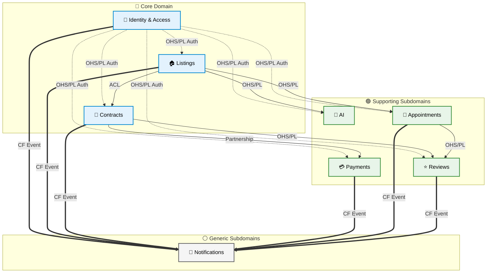

# 02 — Mapa de Bounded Contexts (DDD Context Map)

## Descripción

Este diagrama muestra las relaciones entre todos los bounded contexts de PropConnect, agrupados por tipo de dominio y etiquetados con sus patrones de integración.

**Explicación de los grupos:**
- **Core Domain** (azul): Identity & Access, Listings y Contracts son los contextos que diferencian a PropConnect de un sistema genérico. Sin ellos, el negocio no existe. Reciben la mayor inversión de diseño y mantenimiento.
- **Supporting Subdomains** (verde): Payments, Appointments, Reviews & Ratings y AI Consultant apoyan y enriquecen el core, pero podrían ser reemplazados por soluciones de terceros si fuera necesario.
- **Generic Subdomains** (gris): Notifications es un problema genérico resuelto con herramientas estándar (SendGrid, FCM). No hay ventaja competitiva en construirlo desde cero con lógica sofisticada.

## Leyenda de Patrones de Integración y Relaciones

| Patrón | Símbolo | Descripción en PropConnect |
|---|---|---|
| **OHS/PL** | Open Host Service / Published Language | El contexto proveedor expone una API estable y documentada. El consumidor se adapta a ella sin fricción. |
| **ACL** | Anti-Corruption Layer | El contexto consumidor (downstream) traduce el modelo para no contaminar su propia lógica de dominio (ej. Listing → ContractListing). |
| **CF** | Conformist | El consumidor adopta 100% el modelo del proveedor. Caso de `Notifications`, que consume los eventos (payloads) tal cual llegan. |
| **Partnership** | Coordinación Mutua | Ambos contextos evolucionan resolviendo cambios juntos. Un Contrato no sirve sin un Pago y viceversa. |
| **SK** | Shared Kernel | Partes de código o bases de datos compartidas. *(Solo mencionado por completitud, en esta arquitectura evitamos Shared Kernel para priorizar desacoplamiento).* |

### Guía Visual del Diagrama (Tipos de Flechas)
Para evitar que el diagrama parezca una "telaraña", las flechas (dirección Upstream → Downstream) se categorizan en 3 estilos:
- `--->` **(Sólidas):** Flujos de negocio directos y llamadas API de alta importancia.
- `-.- >` **(Punteadas):** Requisitos técnicos transversales (Como la validación de tokens en IAM). Suaviza el ruido visual.
- `===>` **(Gruesas):** Envío asíncrono de eventos (Pub/Sub). Todos los dominios "disparan" eventos hacia Notifications.

## Notas sobre el Diseño

- **IAM como raíz**: Todos los contextos dependen de IAM para validar identidad. Este es el único contexto verdaderamente transversal y por eso expone OHS/PL.
- **Notifications como receptor puro**: El contexto de Notifications es puramente conformista — no impone ningún modelo a los demás. Si se quita, el sistema sigue funcionando; solo se pierde la entrega de mensajes.
- **AI Consultant como consumidor de solo lectura**: AIC consume datos de Listings y IAM pero nunca escribe en ellos. Este patrón de solo lectura lo hace fácilmente extraíble como microservicio independiente en el futuro.
