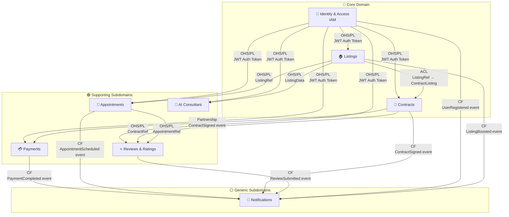

# 02 — Mapa de Bounded Contexts (DDD Context Map)

## Descripción

Este diagrama muestra las relaciones entre todos los bounded contexts de PropConnect, agrupados por tipo de dominio y etiquetados con sus patrones de integración.

**Explicación de los grupos:**
- **Core Domain** (azul): Identity & Access, Listings y Contracts son los contextos que diferencian a PropConnect de un sistema genérico. Sin ellos, el negocio no existe. Reciben la mayor inversión de diseño y mantenimiento.
- **Supporting Subdomains** (verde): Payments, Appointments, Reviews & Ratings y AI Consultant apoyan y enriquecen el core, pero podrían ser reemplazados por soluciones de terceros si fuera necesario.
- **Generic Subdomains** (gris): Notifications es un problema genérico resuelto con herramientas estándar (SendGrid, FCM). No hay ventaja competitiva en construirlo desde cero con lógica sofisticada.

## Leyenda de Patrones de Integración

| Patrón | Símbolo | Descripción en PropConnect |
|---|---|---|
| **OHS/PL** | Open Host Service / Published Language | El contexto proveedor expone una interfaz estable y documentada (`public-api.ts`). El consumidor la usa sin adaptar. Ejemplo: IAM expone `getUserById()` que todos consumen igual. |
| **ACL** | Anti-Corruption Layer | El contexto consumidor traduce el modelo del proveedor al suyo propio para proteger su dominio. Ejemplo: Contracts traduce el `Listing` de LST a su propia entidad `ContractListing`. |
| **CF** | Conformist | El contexto consumidor adopta el modelo del proveedor sin transformación. Ejemplo: Notifications consume eventos de todos los contextos usando sus payloads directamente. |
| **Partnership** | Coordinación mutua | Dos contextos evolucionan juntos. Ejemplo: Contracts y Payments deben coordinarse cuando se firma un contrato que requiere pago. |

## Notas sobre el Diseño

- **IAM como raíz**: Todos los contextos dependen de IAM para validar identidad. Este es el único contexto verdaderamente transversal y por eso expone OHS/PL.
- **Notifications como receptor puro**: El contexto de Notifications es puramente conformista — no impone ningún modelo a los demás. Si se quita, el sistema sigue funcionando; solo se pierde la entrega de mensajes.
- **AI Consultant como consumidor de solo lectura**: AIC consume datos de Listings y IAM pero nunca escribe en ellos. Este patrón de solo lectura lo hace fácilmente extraíble como microservicio independiente en el futuro.
