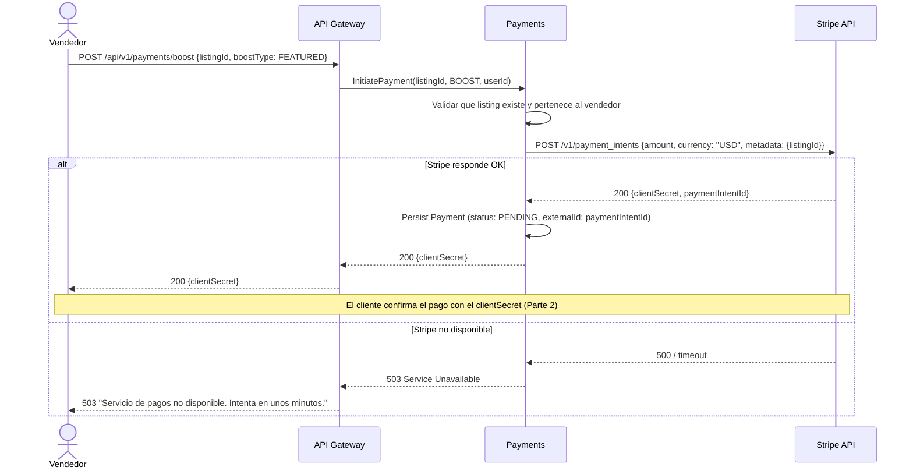
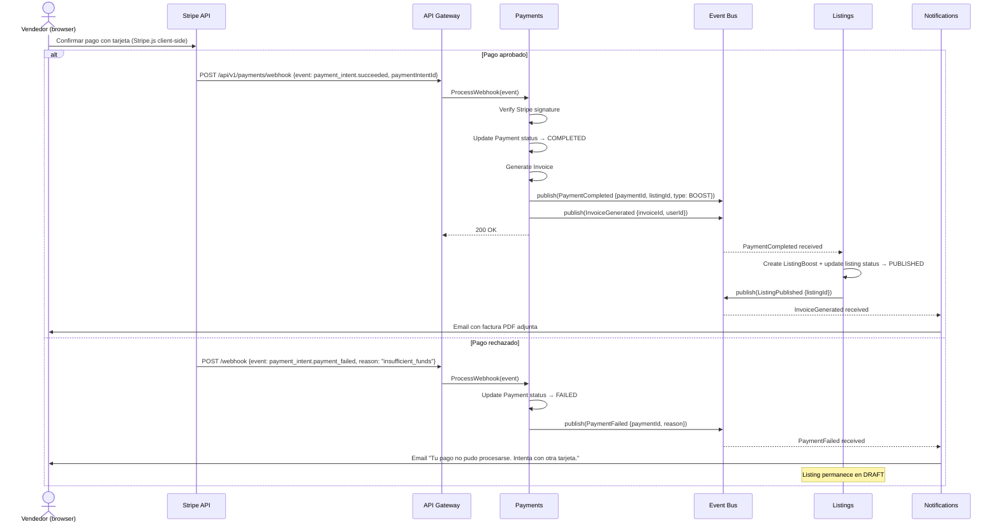
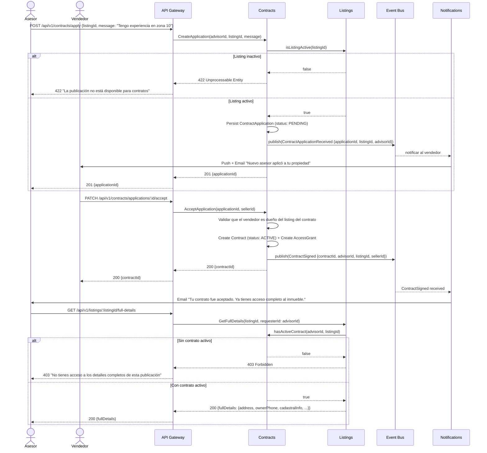
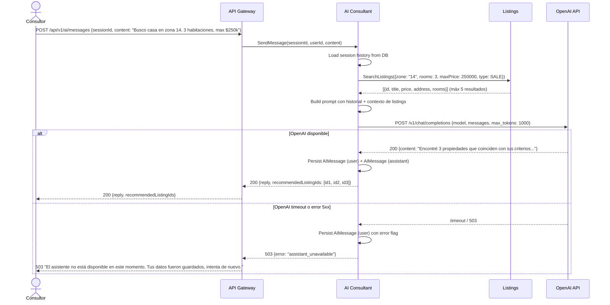

# 03 — Diagramas de Flujo de Datos (Secuencias)

Este documento contiene los diagramas de secuencia de los flujos más importantes de PropConnect. Los flujos están divididos en partes cuando tienen más de 6 participantes para mantener la legibilidad.

---

## Flujo A — Pago de Boost (Parte 1: Iniciación del Pago)

Este flujo muestra cómo un Vendedor paga para destacar su publicación. La Parte 1 cubre desde la solicitud del boost hasta la entrega del `clientSecret` al cliente.

---

## Flujo A — Pago de Boost (Parte 2: Confirmación vía Webhook)

La Parte 2 cubre el procesamiento del webhook de Stripe y la activación del boost.

---

## Flujo B — Firma de Contrato con Asesor (Camino Completo)

Este flujo muestra el ciclo completo: aplicación del asesor → aceptación del vendedor → acceso a datos completos.

---

## Flujo C — Consulta con Asistente IA (Con Fallo de OpenAI)

