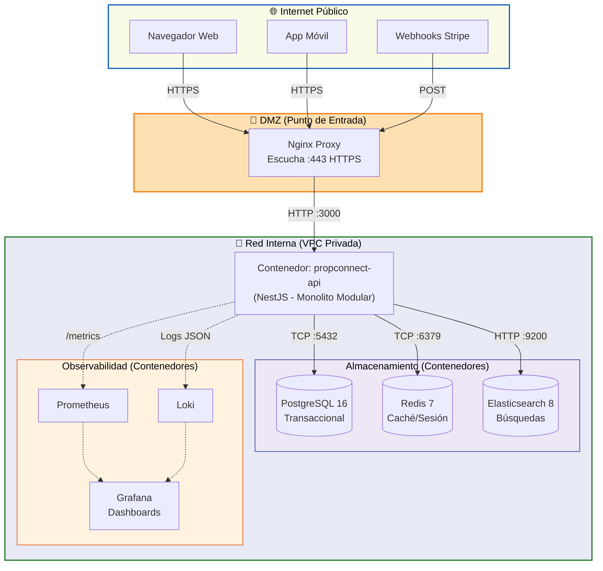
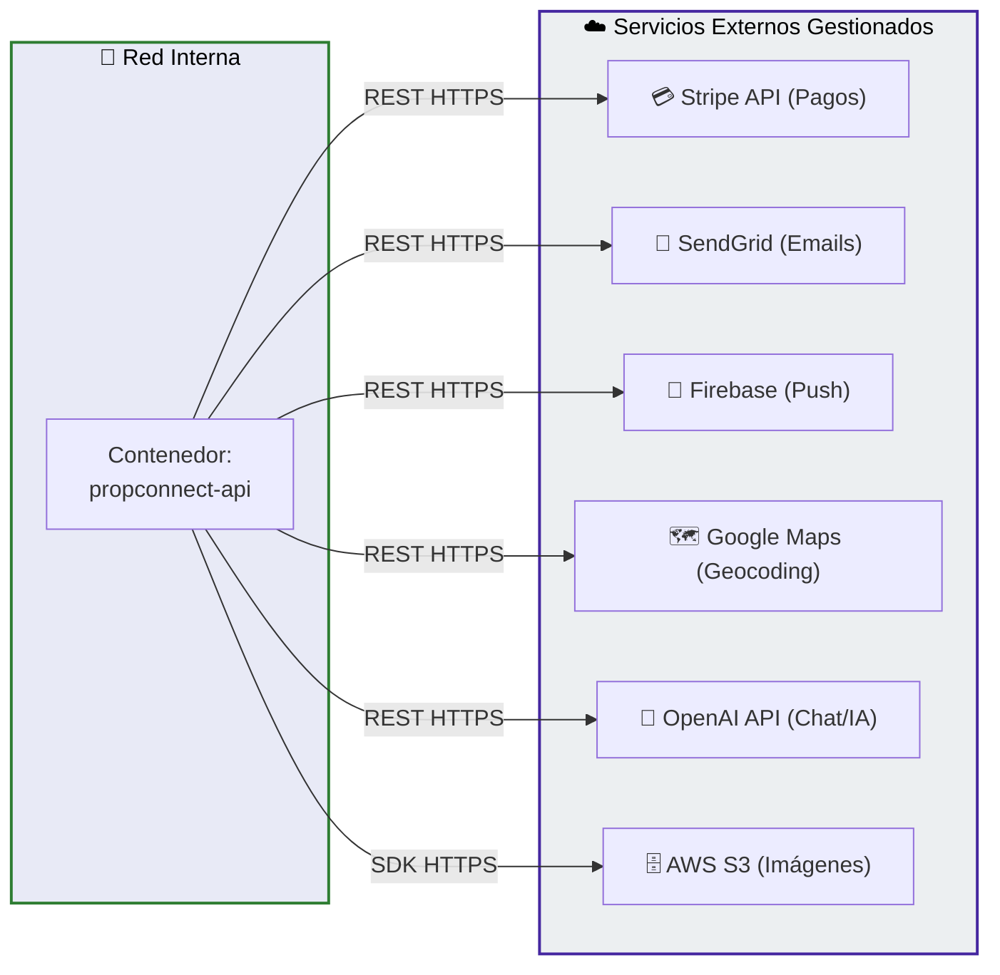

# 04 — Diagrama de Despliegue e Infraestructura

## Descripción

Este diagrama muestra la topología física y lógica del sistema PropConnect en producción. El sistema corre en un único servidor de aplicación (monolito modular) con servicios de datos y observabilidad en contenedores separados. Los servicios externos (Stripe, SendGrid, Firebase, Google Maps, OpenAI) se consumen vía HTTPS.

**Decisiones clave de topología:**
- El monolito corre en un único contenedor Docker detrás de un reverse proxy (Nginx), que también sirve los assets estáticos del frontend.
- PostgreSQL y Elasticsearch tienen sus propios contenedores con volúmenes persistentes. Redis corre como contenedor efímero (caché, no durabilidad crítica).
- El stack de observabilidad (Prometheus, Grafana, Loki) corre en el mismo servidor en la fase inicial. En producción madura, se migraría a infraestructura separada.
- Las zonas de red están divididas en: Internet Público, DMZ (Nginx), Red Interna VPC, y Servicios Gestionados Externos.

> **Nota de visualización:** Para mayor claridad, la arquitectura se ha dividido en dos vistas: la topología interna en la VPC y las integraciones de salida hacia terceros.

### Vista 1: Topología de Red, Datos y Observabilidad

Este diagrama ilustra las zonas de red (Internet, DMZ, VPC), cómo el tráfico de los usuarios fluye hacia la aplicación, y cómo el contenedor principal interactúa con sus bases de datos y herramientas de monitoreo locales.

### Vista 2: Servicios Externos (Egress)

Este diagrama se enfoca exclusivamente en las llamadas de red salientes (egress) que realiza el backend hacia servicios en la nube de terceros completamente gestionados.

## Explicación de Decisiones de Topología

### Nginx como Reverse Proxy
Nginx maneja la terminación SSL/TLS, sirve los assets estáticos del frontend (build de React), y hace proxy al backend en el puerto 3000. Esto separa la responsabilidad de servir contenido estático (bajo costo, alta frecuencia) del procesamiento de la aplicación.

### Un Solo Contenedor para el Monolito
Consistente con ADR-001, el monolito corre como un único proceso. En caso de alta carga en el módulo de Listings, se puede escalar horizontalmente agregando réplicas del contenedor `propconnect-api` detrás de Nginx con `upstream` en round-robin. La sesión es stateless (JWT), lo que hace posible este escalado sin configuración adicional.

### PostgreSQL + Elasticsearch + Redis como Capa de Datos
- **PostgreSQL**: Fuente de verdad para todos los datos transaccionales. Backups automáticos diarios a S3.
- **Elasticsearch**: Solo para búsquedas de Listings. Se sincroniza desde PostgreSQL vía eventos de dominio (ver ADR-003).
- **Redis**: Caché de respuestas de Listings frecuentemente solicitados y almacenamiento de refresh tokens. No es fuente de verdad — si cae, el sistema funciona con degradación de rendimiento.

### Observabilidad en el Mismo Servidor
En la fase inicial, Prometheus, Grafana y Loki corren en el mismo servidor para simplificar la operación. Esto tiene el riesgo de que si el servidor falla, también se pierden los logs. En producción madura, se migraría a un servidor dedicado o a servicios gestionados (Grafana Cloud, Datadog).

### S3 para Imágenes
Las imágenes de los inmuebles (fotos de propiedades) no se almacenan en el contenedor ni en PostgreSQL. Se suben directamente a AWS S3 desde el cliente (presigned URLs) y las URLs se guardan en la tabla `lst_properties.mediaUrls`. Esto evita que el servidor de la aplicación sea un cuello de botella para uploads de imágenes pesadas.

### Zonas de Red
- **Internet Público**: Solo Nginx está expuesto en el puerto 443.
- **VPC Interna**: PostgreSQL, Elasticsearch, Redis y los contenedores de observabilidad no son accesibles desde Internet. Solo el contenedor `propconnect-api` puede conectarse a ellos.
- **Servicios Externos**: Todas las llamadas salientes a APIs externas van sobre HTTPS. Las credenciales se inyectan como variables de entorno en el contenedor, nunca en el código fuente.
